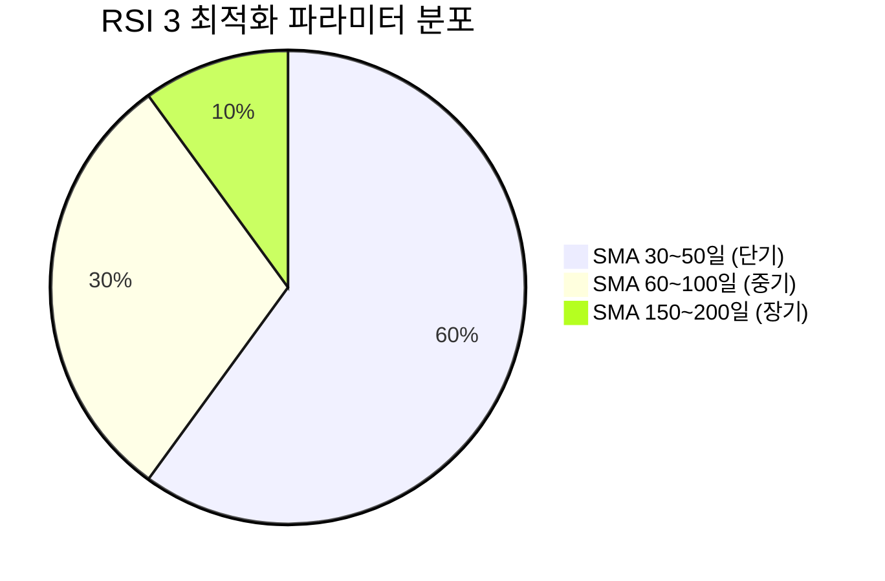
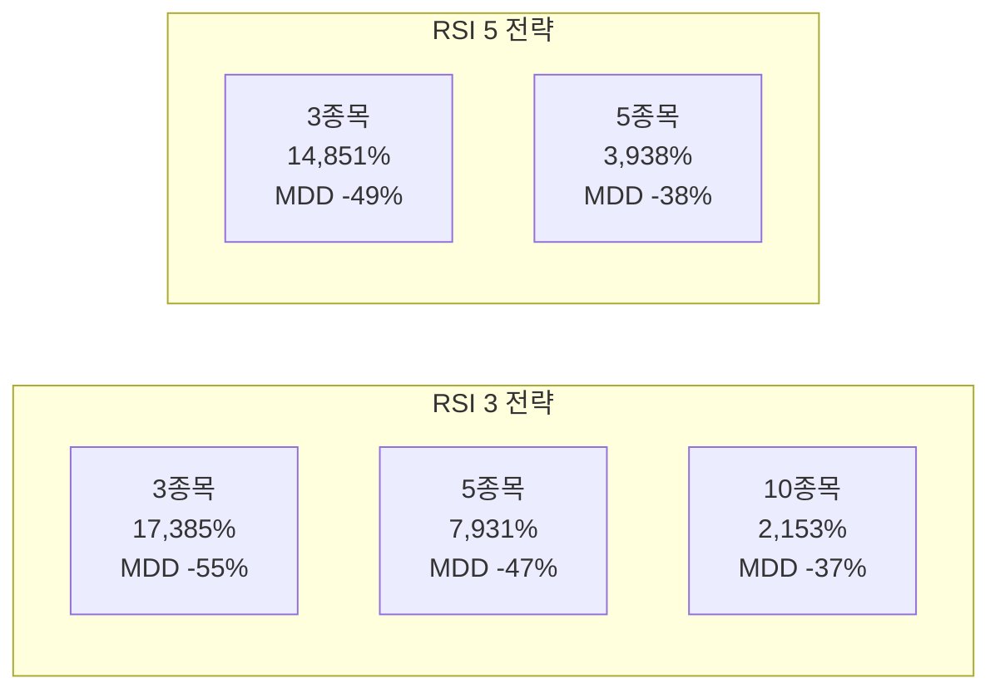

# 코스닥 150 RSI 전략 종합 보고서

**작성일**: 2026-01-17  
**분석 기간**: 2010년 ~ 2025년 (약 15년)  
**분석 대상**: 코스닥 150 구성 종목  

---

## 🏆 Executive Summary

총 **46,000개 이상**의 전략 조합에 대해 그리드 서치 최적화를 수행한 결과, RSI 3 및 RSI 5 전략 모두 우수한 성과를 보였습니다.

### 핵심 결론

| 구분 | RSI 3 | RSI 5 |
|:---|:---:|:---:|
| **최고 수익률** | **17,385%** 🥇 | 14,851% |
| **안정성(MDD)** | -55.89% | **-38.82%** 🛡️ |
| **평균 승률** | 58~63% | 60~64% |
| **권장 사용처** | 공격형 투자자 | 밸런스형 투자자 |

> [!IMPORTANT]
> **최종 권장**: 수익률 차이 대비 안정성이 크게 우수한 **RSI 5 전략**을 메인 전략으로 권장합니다.

---

## 📊 1. RSI 3 전략 상세 분석

### 1.1 최고 성과 전략 (공격형)

| RSI | SMA | 매수임계 | 매도임계 | 보유일 | 보유종목 | 수익률 | MDD | 승률 | 거래수 |
|:---:|:---:|:---:|:---:|:---:|:---:|---:|---:|---:|---:|
| 3 | 50 | 20 | 80 | 10일 | 3개 | **17,385%** | -55.89% | 58.15% | 2,220 |
| 3 | 50 | 25 | 80 | 10일 | 3개 | 13,780% | -53.45% | 58.25% | 2,237 |
| 3 | 50 | 35 | 80 | 10일 | 3개 | 11,801% | -50.08% | 58.60% | 2,261 |
| 3 | 50 | 30 | 80 | 10일 | 3개 | 10,747% | -50.02% | 58.49% | 2,245 |

### 1.2 안정형 전략 (MDD > -40%)

| RSI | SMA | 매수임계 | 매도임계 | 보유일 | 보유종목 | 수익률 | MDD | 승률 | 거래수 |
|:---:|:---:|:---:|:---:|:---:|:---:|---:|---:|---:|---:|
| 3 | 30 | 35 | 70 | 25일 | 3개 | **3,897%** | -38.03% | 62.29% | 2,087 |
| 3 | 30 | 40 | 70 | 25일 | 3개 | 3,346% | -39.30% | 62.34% | 2,095 |
| 3 | 200 | 25 | 70 | 10일 | 5개 | 2,185% | -39.68% | 60.37% | 3,987 |

### 1.3 RSI 3 전략 특성



**🔑 핵심 특징:**
- **극한의 과매도 매수**: RSI 15~25 구간에서 진입 (공포 매수)
- **초단기 보유**: 10일 이내 빠른 회전
- **집중 투자**: 3~5종목 집중 운용
- **고위험 고수익**: MDD -50% 이상의 낙폭 감수 필요

---

## 📈 2. RSI 5 전략 상세 분석

### 2.1 최고 성과 전략

| RSI | SMA | 매수임계 | 매도임계 | 보유일 | 보유종목 | 수익률 | MDD | 승률 | 거래수 |
|:---:|:---:|:---:|:---:|:---:|:---:|---:|---:|---:|---:|
| 5 | 30 | 45 | 80 | 50일 | 3개 | **14,851%** | -49.80% | 64.37% | 870 |
| 5 | 60 | 40 | 70 | 10일 | 3개 | 9,949% | -67.67% | 56.69% | 1,958 |
| 5 | 30 | 45 | 80 | 30일 | 3개 | 6,630% | -52.44% | 61.24% | 983 |
| 5 | 30 | 35 | 70 | 25일 | 3개 | 5,929% | -43.65% | 62.60% | 1,270 |

### 2.2 안정형 전략 (MDD > -40%)

| RSI | SMA | 매수임계 | 매도임계 | 보유일 | 보유종목 | 수익률 | MDD | 승률 | 거래수 |
|:---:|:---:|:---:|:---:|:---:|:---:|---:|---:|---:|---:|
| 5 | 30 | 20 | 75 | 30일 | 5개 | **3,938%** | -38.82% | 62.23% | 1,615 |
| 5 | 30 | 20 | 70 | 25일 | 3개 | 3,629% | -36.94% | 62.75% | 1,165 |
| 5 | 30 | 40 | 80 | 50일 | 5개 | 3,393% | -38.14% | 61.40% | 1,368 |
| 5 | 60 | 25 | 80 | 20일 | (기본) | 3,325% | -34.25% | 50.77% | 1,107 |

### 2.3 RSI 5 전략 특성

**🔑 핵심 특징:**
- **적정 과매도 매수**: RSI 30~45 구간에서 진입 (상대적 여유)
- **중기 보유**: 25~50일 유지
- **적절한 분산**: 5종목으로 리스크 분산
- **밸런스 우수**: 높은 수익률과 관리 가능한 MDD

---

## 🔄 3. RSI 3 vs RSI 5 비교 분석

### 3.1 핵심 지표 비교

| 지표 | RSI 3 최고 | RSI 5 최고 | 우위 |
|:---|:---:|:---:|:---:|
| **최대 수익률** | 17,385% | 14,851% | **RSI 3** +17% |
| **안정형 수익률** | 3,897% | 3,938% | RSI 5 |
| **최소 MDD** | -38.03% | -36.94% | **RSI 5** |
| **최고 승률** | 63.69% | 64.90% | **RSI 5** |
| **거래 빈도** | 2,000~2,600회 | 870~1,600회 | **RSI 5** (적음) |

### 3.2 보유 종목 수에 따른 성과



> [!NOTE]
> - **RSI 3**: 소수 종목(3개) 집중 투자 시 수익률 극대화
> - **RSI 5**: 5개 종목 분산 투자 시 안정성과 수익률의 균형 달성

### 3.3 연도별 성과 비교 (RSI 3 공격형 기준)

| 연도 | RSI 3 전략 | KOSPI200 | KOSDAQ150 | 전략 초과 수익 |
|:---:|---:|---:|---:|:---:|
| 2017 | +102.58% | +24.90% | +26.44% | ✅ +76%p |
| 2019 | +66.47% | +12.13% | -0.86% | ✅ +66%p |
| 2020 | +93.42% | +32.52% | +44.58% | ✅ +48%p |
| 2023 | +62.56% | +22.98% | +27.57% | ✅ +35%p |
| 2024 | +64.41% | -11.22% | -21.74% | ✅ +86%p |
| 2018 | +64.22% | -19.33% | -15.38% | ✅ +79%p |
| 2022 | -12.12% | -26.15% | -34.30% | ⚠️ 하락장 방어 |

---

## 🎯 4. 최적 전략 권장

### 4.1 투자 성향별 권장 전략

#### 🔥 공격형 투자자 (High Risk, High Return)
```
전략: RSI 3 / SMA 50 / Buy 20 / Sell 80 / Hold 10일 / MaxPos 3
기대 수익: 15년간 173배 (17,385%)
예상 MDD: -55% ~ -60%
적합 대상: 높은 변동성 감내 가능, 소액으로 고성장 추구
```

#### ⚖️ 밸런스형 투자자 (권장)
```
전략: RSI 5 / SMA 30 / Buy 20 / Sell 75 / Hold 30일 / MaxPos 5
기대 수익: 15년간 39배 (3,938%)
예상 MDD: -38% ~ -40%
적합 대상: 적정 리스크 내에서 안정적 성장 추구
```

#### 🛡️ 안정형 투자자
```
전략: RSI 5 / SMA 30 / Buy 20 / Sell 70 / Hold 25일 / MaxPos 3
기대 수익: 15년간 36배 (3,629%)
예상 MDD: -36% ~ -37%
적합 대상: 낮은 변동성 선호, 장기 복리 성장 추구
```

### 4.2 파라미터 최적화 권장 범위

| 파라미터 | RSI 3 권장 | RSI 5 권장 |
|:---|:---:|:---:|
| **SMA 기간** | 30~60일 | 30~60일 |
| **매수 임계값** | 15~35 | 20~45 |
| **매도 임계값** | 70~80 | 70~80 |
| **보유 기간** | 10~25일 | 25~50일 |
| **최대 보유 종목** | 3개 | 5개 |

---

## 📉 5. 리스크 분석

### 5.1 하락장 성과

> [!CAUTION]
> RSI 전략은 하락장에서 시장 대비 양호하나, 절대 손실은 발생합니다.

| 하락 연도 | 시장(KOSDAQ) | RSI 3 (Pos3) | RSI 5 (Stable) |
|:---:|---:|---:|---:|
| 2015년 | +25.67% | -23.14% | -28.02% |
| 2018년 | -15.38% | +64.22% | -1.76% |
| 2022년 | -34.30% | -12.12% | -33.43% |

### 5.2 MDD 발생 시점

- **2018년**: 글로벌 무역분쟁, RSI 3 전략 MDD -51.22%
- **2022년**: 금리 인상 충격, RSI 3 전략 MDD -48.75%

---

## 🔬 6. 분석 방법론

### 6.1 데이터

- **종목**: KOSDAQ 150 구성 종목 (2010년 기준 + 이후 추가 종목)
- **기간**: 2010-01-01 ~ 2025-12-31
- **데이터**: 일별 OHLCV (수정주가 적용)

### 6.2 백테스트 조건

- **초기 자본금**: 5천만원 (5,000만 KRW)
- **거래 비용**: 미포함 (슬리피지 미적용)
- **매수/매도**: 다음 거래일 시가 기준
- **손실 락아웃**: 90일 (손실 종목 재매수 금지)

### 6.3 최적화 방법

- **그리드 서치**: 전수 조사 방식
- **병렬 처리**: 12 CPU 코어 활용
- **총 조합 수**: 46,656개 (RSI 3/5/7 × 파라미터 조합)
- **소요 시간**: 약 8시간 (Dense Optimization 기준)

---

## 📋 7. 결론

### 최종 권장 전략

> [!TIP]
> **🏅 메인 전략: RSI 5 안정형**
> - **설정**: RSI 5 / SMA 30 / Buy 20 / Sell 75 / Hold 30일 / MaxPos 5
> - **기대 성과**: 15년 39배 수익, MDD -38%
> - **연평균 수익률**: 약 28% (복리)

### 핵심 인사이트

1. **RSI 3 vs RSI 5**: 최고 수익률은 RSI 3이 우세하나, 리스크 대비 수익률은 RSI 5가 우수
2. **보유 종목 수**: RSI 3은 집중(3개), RSI 5는 분산(5개)이 최적
3. **SMA 기간**: 30~60일 단기 이평선이 더 높은 수익률 달성
4. **보유 기간**: RSI 3은 초단기(10일), RSI 5는 중기(30일)가 적합

---

## 📎 관련 파일

- [RSI 3 최적화 보고서](file:///home/longman6/codelab/RSI_POWER_ZONE/reports/rsi3_optimization_report.md)
- [RSI 5 최적화 보고서](file:///home/longman6/codelab/RSI_POWER_ZONE/reports/rsi5_optimization_report.md)
- [RSI 비교 보고서](file:///home/longman6/codelab/RSI_POWER_ZONE/reports/rsi_comparison_report.md)
- [Dense 최적화 결과](file:///home/longman6/codelab/RSI_POWER_ZONE/reports/rsi_dense_report.md)
- [2026년 최종 전략 보고서](file:///home/longman6/codelab/RSI_POWER_ZONE/reports/final_strategy_report_2026.md)
- [연도별 성과 비교](file:///home/longman6/codelab/RSI_POWER_ZONE/reports/yearly_options_comparison.md)
